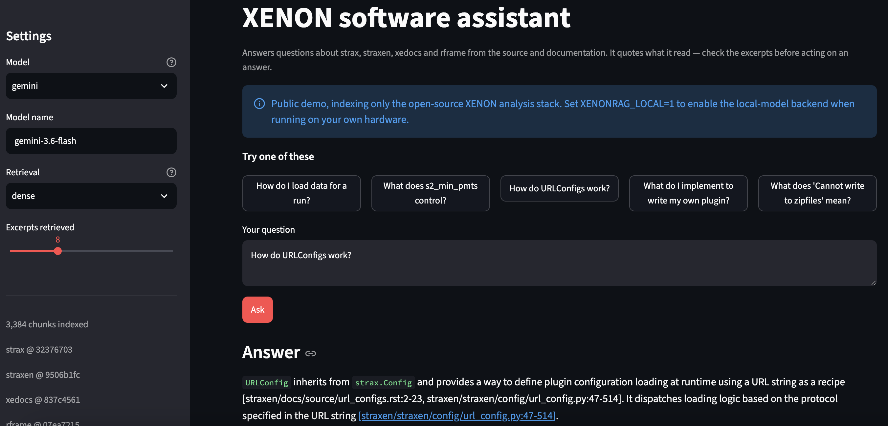
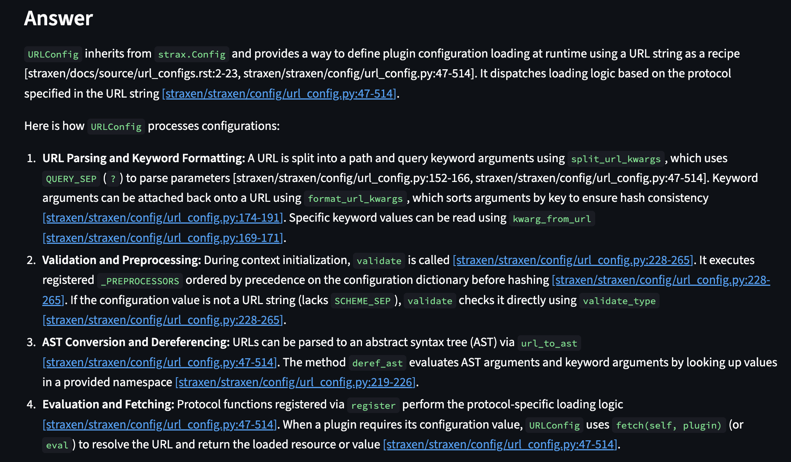
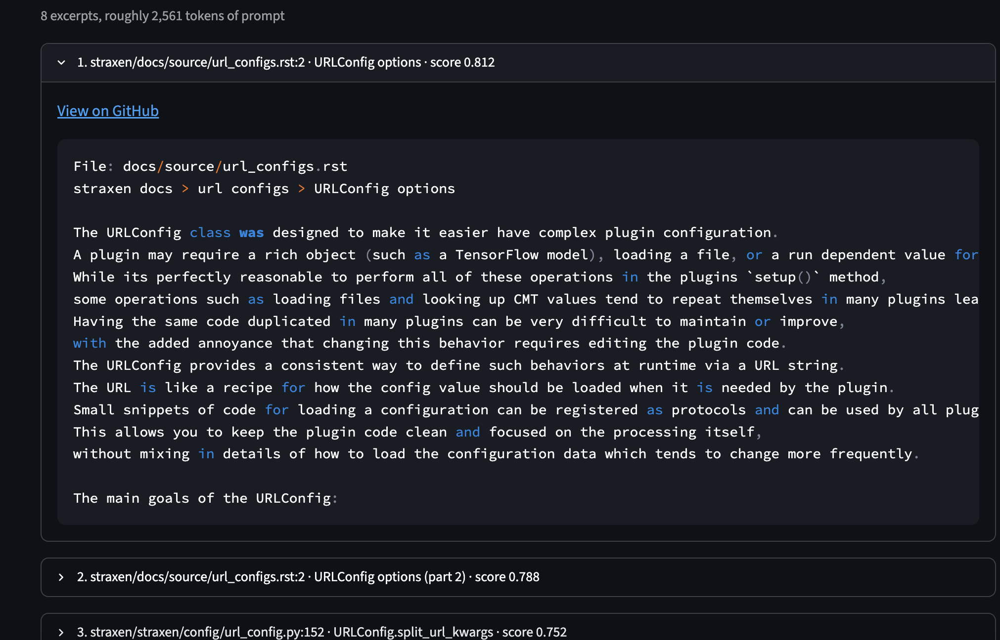

# XENON software assistant

A question-answering assistant over the XENON dark matter experiment's analysis
software — [strax](https://github.com/AxFoundation/strax),
[straxen](https://github.com/XENONnT/straxen),
[xedocs](https://github.com/XENONnT/xedocs) and
[rframe](https://github.com/jmosbacher/rframe). It answers from the source and
documentation rather than from the model's memory, cites the exact lines it
used, and says so when the corpus does not contain an answer.

**[Live demo](TODO)**  ·  built for physicists onboarding onto a framework with
roughly 70,000 lines of code and comparatively thin conceptual documentation.





Sources:

---

## Why

The XENONnT collaboration shares an analysis framework that new members have to
learn largely by reading source and asking in Slack. The same questions recur,
the answers live scattered across four repositories, and the people who know
them are the people with the least time.

A retrieval-augmented assistant fits this shape well: the corpus is fixed,
correctness is checkable against the source, and a wrong answer is expensive
because the reader will run it.

## How it works

    question ──► retrieve ──► prompt ──► model ──► answer + line-level citations
                    │
                    └── FAISS over ~3,200 chunks of code, docs and notebooks

Indexing is offline and syntax-aware rather than character-based. Python is
parsed with `ast`, so a chunk is a function, a method, a class summary, or a
single configuration option. Prose and notebooks are split
on headings, and short documents are kept whole.

Each chunk carries two texts: a short form that is **embedded**, and a longer
form that is sent to the **model**. The embedding model reads at most 512
tokens and truncates silently past that, so anything longer would be indexed
from a fragment of its own content. The prompt has no such limit and benefits
from seeing the whole function.

Chunks also carry metadata the prompt uses: whether a method is an abstract
extension point, deprecated, or deliberately unsupported; whether a module is
public API; and the base classes of the enclosing class, so a method retrieved
alone is not orphaned from its hierarchy.

## Results

Measured on a hand-labelled benchmark of 42 questions, drawn from collaboration
support channels and from onboarding experience, each labelled with the files
that contain the answer.

### Retrieval

| | recall@5 | recall@10 | recall@20 |
|---|---|---|---|
| initial | 57% | 68% | 76% |
| after chunking fixes | **72%** | **83%** | **86%** |

The gain came entirely from how the corpus was cut up, not from the retrieval
algorithm. Three specific defects, each found by reading retrieval output
rather than by testing:

- All of a plugin's configuration options shared one chunk, so a question about
  any single option matched a blurred average of all of them. *"What does
  `s2_min_pmts` control?"* was outside the top 100. One chunk per option:
  configuration questions went 0/2 → 2/2.
- A 515-byte pull-request template was split into four context-free fragments
  by heading. Documents shorter than one chunk are now kept whole.
- Very long functions embedded as a wall of parameter defaults —
  `straxen.contexts.xenonnt` has a signature of 1,222 characters, 83% of the
  embedding budget, which pushed the docstring out entirely. Signatures are now
  capped and docstrings come first.

### Hybrid retrieval made things worse

Adding BM25 keyword search and fusing by reciprocal rank is the standard
recommendation. Measured here:

| | recall@5 | recall@10 |
|---|---|---|
| dense only | **57%** | **68%** |
| BM25 only | 41% | 57% |
| hybrid (RRF) | 51% | 62% |

BM25 rescued three questions and lost nine. Reciprocal rank fusion assumes both
retrievers are of comparable quality; when one is substantially weaker, equal
weighting lets it dilute the other. The code supports weighted fusion, and the
default configuration uses dense retrieval alone.

The corpus explains it. Terms that look distinctive — "correction", "plugin",
"peak" — are ubiquitous here and carry almost no inverse-document-frequency
weight, while the embedding tokenizer already splits `merge_without_s1` into
meaningful subwords, so dense retrieval was not as blind to identifiers as
expected.

### Answers

<!-- TODO: fill in from eval/answers*.json after grading -->

| | correct or partial | cites a source | cites only retrieved files |
|---|---|---|---|
| Qwen 3 8B (local) | 86% | TODO | TODO |
| Gemini 3.6 Flash | TODO | TODO | TODO |

Qwen 3 8B and the older Qwen 2.5 Coder 7B scored within noise of each other on
this benchmark, despite the newer model being widely described as a generation
ahead for instruction following.

Citation compliance is checked mechanically: a citation naming a file that was
not among the retrieved excerpts is counted separately, since a fabricated
citation is worse than none — it looks checkable and is not.

## What the evaluation changed

Every prompt rule in `xenonrag/prompt.py` exists because of an observed failure:

- The model invented a usage example (`PeakletClassificationVanilla().compute(peaklets)`)
  that is not how strax plugins are used. → Quote examples from the excerpts or
  say there are none.
- Both models asserted which plugin was the default. The evidence lives in
  `contexts.py`, which that question never retrieves. → Never claim a default
  unless an excerpt says so.
- Excerpts were headed `[1] path:15-40` while citations were requested as
  `[path:LINE]`; models merged the two into `[1/path:15-40]`. → The header is
  now literally the citation string.
- A citation rule stated once near the top was ignored by the 8B model. A
  worked example placed immediately before the answer was followed. Format
  compliance is about position and concreteness, not emphasis.

A retrieval-confidence signal was tried and removed: the corpus is topically
homogeneous, so the nearest neighbour to an unanswerable question still scores
0.74 against 0.75–0.85 for answerable ones. The distributions overlap almost
entirely, and a threshold that caught the bad cases would have flagged half the
good ones.

## Limitations

- **Single-hop retrieval.** Answering *"which classification plugin is the
  default?"* requires knowing that `contexts.py` registers it, which no query
  about classification will retrieve. Multi-hop retrieval would fix this class
  of question.
- **Phrasing sensitivity.** Two near-identical questions can retrieve
  differently: *"what are the kinds of plugins"* finds the plugin development
  guide at rank 2; *"how do I write my own plugin"* does not find it in 100
  results. Query expansion is the obvious next step.
- **Roughly a quarter of questions have no gold file in the top 40**, so the
  answer is simply absent from the prompt. No amount of prompt engineering
  recovers those.
- **Documentation gaps are inherited.** The plugin that runs by default does
  not say so in its own docstring. The assistant cannot report what the corpus
  does not contain, and surfacing these gaps is arguably as useful as answering.

## Running it

```bash
git clone <this repo> && cd xenon-rag
python -m venv .venv && source .venv/bin/activate
pip install -r requirements.txt

# rebuild the index from source (optional -- build/ is committed)
mkdir repos && cd repos
git clone https://github.com/AxFoundation/strax.git
git clone https://github.com/XENONnT/straxen.git
git clone https://github.com/XENONnT/xedocs.git
git clone https://github.com/jmosbacher/rframe.git
cd .. && python scripts/build_index.py

export GEMINI_API_KEY=...
streamlit run app/streamlit_app.py
```

Retrieval alone, with no model call:

```bash
python scripts/search.py "how do I load data for a run" --links
python eval/run_eval.py --retrievers dense bm25 hybrid
```

With a local model instead of the API:

```bash
ollama pull qwen3:8b
XENONRAG_LOCAL=1 streamlit run app/streamlit_app.py
python scripts/ask.py "..." --backend ollama
```

## Deployment notes

The index is committed (~6 MB), so the app never clones a repository or runs
the chunker at startup. If the hosted deployment runs out of memory, the
culprit is `torch`, pulled in by `sentence-transformers` purely to embed the
query; switching that one call to an ONNX runtime removes it.

## Tests

```bash
python -m pytest tests/ -q      # 160 tests
```

The ones worth reading are the invariants at the bottom of
`tests/test_chunking.py`. They encode properties that must hold regardless of
chunking strategy — most importantly that no chunk's embedded text exceeds the
embedding model's context window, which is the constraint behind the largest
single retrieval defect found in this project and the kind of failure that is
silent rather than loud.

## Layout

```
xenonrag/
  chunking.py    source and docs -> chunks
  embed.py       embedding backends
  index.py       FAISS build/load, with a manifest guarding against
                 querying an index built by a different model
  retrieve.py    dense, BM25, and rank fusion
  prompt.py      context budgeting and prompt construction
  llm.py         Gemini and Ollama behind one interface
  answer.py      end to end
scripts/         build_index, search (retrieval only), ask (full pipeline)
eval/            questions.yaml and the harness
app/             Streamlit interface
```

## License

MIT. Indexes only public repositories.